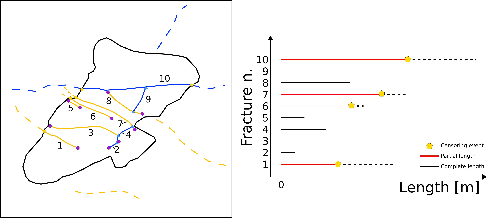

<div align="center">


[](https://github.com/gbene/FracAbility/releases/)
[](#license)
[](https://github.com/gbene/FracAbility/issues)
[](https://python.org "Go to Python homepage")

</div>

## Quick introduction ⚡



Fracture networks are essential for the analysis and modelling of mechanical and hydraulic properties 
of rock masses. Recently, the use of Digital Outcrop Models (**DOMs**) provided a solid framework for the collection 
of large and quantitative datasets from which different properties can be extracted.
Because of the complex nature of exposed rock outcrops, statistical model fitting can sometimes be challenging. 
Areas covered by rock debree, vegetation patches or simply the outer boundaries of the outcrop can 
introduce right-censoring bias and can often lead to parameter underestimation. Tools are needed to correct for estimating the correct distribution parameters while taking into account this bias. Survival analysis techniques, although usually applied in function of time and not length, accomplishes exactly this.

**FracAbility** is a Python toolbox that can be used to analyse fracture networks and estimate length distributions considering and correcting the effect of right-censoring using survival analysis. This package provides tools to:

1. Define the topology of fracture networks 
2. Estimate multiple fracture length distributions while taking into consideration 
right censoring effects. 
3. Provide methods to choose the most representative distribution using both a visual and a quantitative approach  

Please refer to the [Docs](https://fracability.readthedocs.io/en/latest/) for a more in depth introduction to the problem, theoretical background, examples and API overview. 

## Installation 🔧

To install FracAbility **pip** can be used:

```bash
pip install fracability
```

Please refer to the [Docs](https://fracability.readthedocs.io/en/latest/Quickstart.html) for further guidance

## Documentation 📚

Click here to view the online documentation:

[](https://fracability.readthedocs.io/en/latest/index.html "Go to online documentation")

Click here to view the source code for the documentation:

[](/docs/ "Go to project documentation")


## Authors 💎✨

 + **Gabriele Benedetti** ([gabri.benedetti@gmail.com](mailto:gabri.benedetti@gmail.com))
 + Stefano Casiraghi ([s.casiraghi21@campus.unimib.it](mailto:s.casiraghi21@campus.unimib.it))
 + Daniela Bertacchi ([daniela.bertacchi@unimib.it](mailto:daniela.bertacchi@unimib.it))
 + Andrea Bistacchi ([andrea.bistacchi@unimib.it](mailto:andrea.bistacchi@unimib.it))

## License 📄

Released under [AGPL-3.0](/LICENSE) by [@gbene](https://github.com/gbene)
