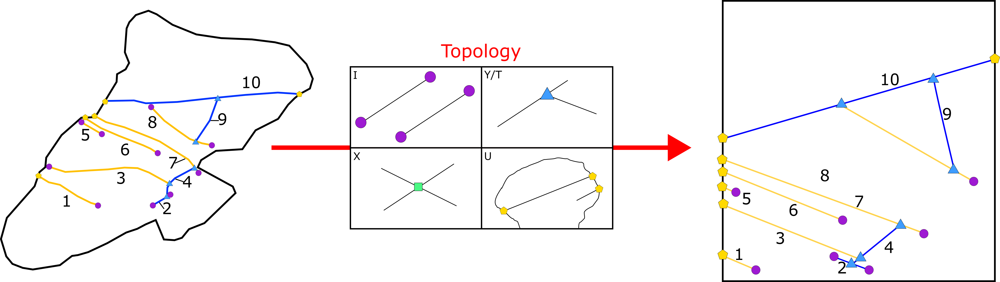
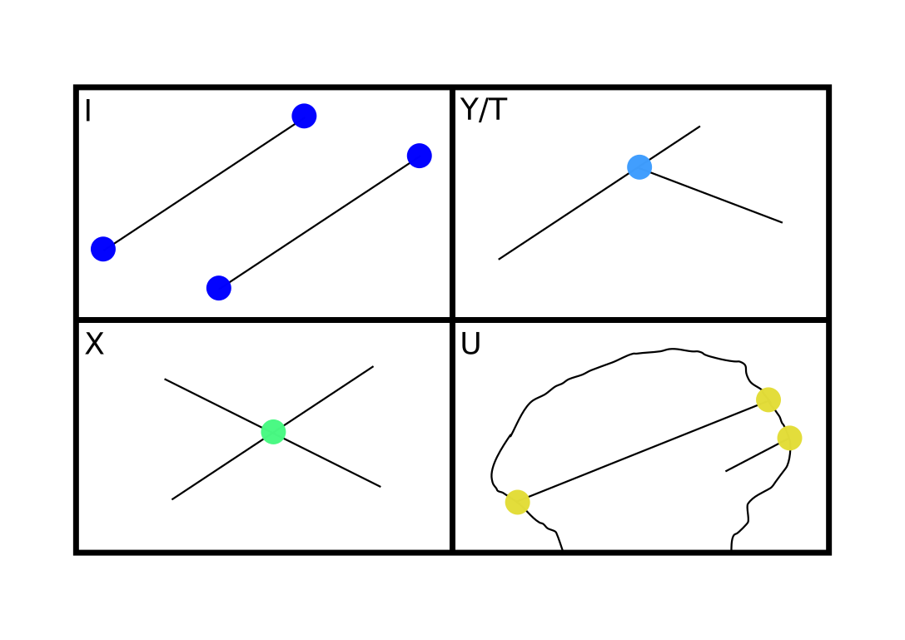

.. image:: ../images/logo.png

-------------------------------------

Topology
======================================

Graph theory and node classification
~~~~~~~~~~~~~~~~~~~~~~~~~~~~~~~~~~~~~~

With nodes it is possible to analise a fracture network in a more abstract way by defining connections and relations
between fracture segments. In a fracture network, fractures are connected in different ways (and sometimes
even isolated) and by focussing on the topological relationships between objects  it is possible to extrapolate interesting
descriptive features. A complex fracture network can be simplified by defining a Graph (G) composed of Edges (E) and Vertices (V)
such that for each edge there are **two** vertices. This means that the **degree** at each node
(i.e. how many edges are connected to a node) can be used to classify them accordingly.

   Abstraction example of a small fracture network. Spatial relationships are partially conserved to help in the comparison.
   Higher abstraction is possible in which the spatial dimension is completely disregarded.

Node classes
+++++++++++++

Four classes of nodes have been defined:

+ I nodes: Given by a termination of a fracture in the outcrop
+ Y or T nodes: Given by a termination of a fracture on **another fracture**
+ X nodes: Given by crossing fractures
+ U nodes: Given by a termination of a fracture on a **boundary**

   Schematic representation of the different node classes. For each cell highlighted the corresponding node.

Geologically each node type can give information on the nature of the fracture and the genetic processes of the network.
I and U nodes define the "completeness" of the given fracture.
An isolated fracture (i.e. bounded by two I vertices) is whole and so its length is complete
while the presence of U nodes will identify a cut fracture with a partial length.

Y and X nodes are useful on the other hand to define the relative chronology. For example in joints, Y nodes identify
abutting relationships (i.e. older cutting younger). X nodes on the other hand indicate cross-cutting relationships.

I Y and X nodes are also useful to describe the connectivity of the network; connected networks will have a higher
proportions of Y and X nodes while the opposite will be defined by a dominance of I nodes. Using this principles,
networks can be graphically represented in a ternary plot such as the one below.

.. figure:: ../images/ternary_plot.png
   :align: center

   Ternary plot of a fracture network. The red dot corresponds to the I, Y and X nodes proportions of the outcrop. The
   contour lines are the average number of connections per fracture derived from equation **A6** in Manzocchi (2002).

