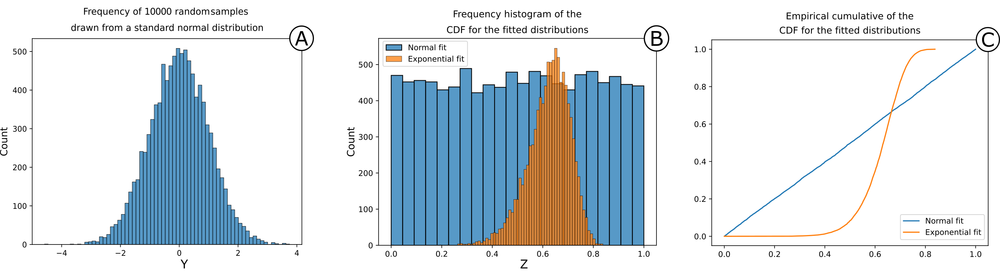

.. image:: ../images/logo.png

-------------------------------------

Statistical parametrization
~~~~~~~~~~~~~~~~~~~~~~~~~~~~~~~~~~~~~~

The immediate problem that arises when performing a statistical analysis on a fracture length dataset is that often fractures are cut by boundaries thus giving partial length information. This type of data is defined as **censored
data**.

.. figure:: ../images/oniscent_view.png
   :align: center

   Censoring effect on an example of a simple fracture network and corresponding survival diagram.

Censoring
++++++++++
Censoring bias is a common problem in many fields of study outside geology. In medical, biological, and engineering applications it is treated with statistical techniques called survival analysis, life testing, or reliability analysis. Applications range from measuring survival times of fatal diseases to establishing the durability of a given component in a machine. In this branch of statistics, the typical questions are:

1.	What is the probability that a unit will fail before a given time?
2.	What percentage of items will last longer than a certain time?
3.	What is the proportion of a population that will survive beyond a given time?

In general censoring can be of three main types:

1.	Right censoring: the event happens after the end of the study period and thus we partially observe the length of the event;
2.	Left censoring: the event happens before the start of the study and thus we do not observe it;
3.	Interval censoring: the event happens somewhere between observations intervals within the study period, usually because it is impossible to continuously monitor the occurrence of the event.

Parameter estimation with censored data: MLE solution
++++++++++++++++++++++++++++++++++++++++++++++++++++++

When trying to estimate a parameter from the data, and eventually fit a distribution, censored data must be corrected or
underestimation is assured. To do this the Maximum Likelihood Estimator (MLE) can be used.MLE is an asymptotic (i.e. true for large samples), consistent (i.e. estimation reaches the population parameter as sample size increases) and efficient (i.e. lowest variance) estimator (Enders, 2005). The main objective of MLE is, given a fixed model **g** (i.e. an assumed theoretical distribution) and sample **x** of size n, to estimate the parameters :math:`\hat{\theta}` of **g** most likely to have produced **x** (Burnham and Anderson, 2002, 2004; Karim and Islam, 2019).

In the simplest 1D case (estimation of the parameter of a one-parameter distribution), the likelihood can be described as a chain product of probabilities carried out on all n individuals in the sample:

.. math:: L(\theta|x,g)=\prod_{i=1}^{n}P(x_i)
    :label: simple_like

Where P(x) is the PDF of the given model.

If all measurements are complete, then equation :eq:`simple_like`  is sufficient to find the optimal parameter of the given distribution. However, since right-censored data are partial, the probabilities associated with such data cannot be calculated using the PDF. To calculate the MLE for censored data, equation :eq:`simple_like` cannot be used. However, for random censoring (assuming independence of the censoring events), the formula can be modified by adding a second term used to calculate the probability of survival for the given censored measure using the model’s Survival Function (SF) :math:`S\left(x\right)`:

.. math:: L(\theta|x,g)=\prod_{i=1}^{n}{P(x_i)^{\delta_i}S(x_i)^{1-\delta_i}}
    :label: surv_like

Where :math:`\delta` is an on-off switch for complete (:math:`\delta = 1`) or censored values (:math:`\delta = 0`).

.. note::

    Simple approaches, to be avoided, could still use equation :eq:`simple_like` either by:

    1. Ignore censoring, considering censored lengths as if they were complete;
    2. Exclude censored measurements (i.e. cherry-picking data).

    These methods however will **always lead to an underestimation** of the model's parameters because in both cases, longer values will be excluded. Furthermore, the second method also hinders the estimator’s precision since there is an effective decrease in the number of measurements used to fit the model (MLE is, as stated above, consistent).

.. note::
    It is strongly encouraged to read the `Reliability Theory <https://reliability.readthedocs.io/en/latest/What%20is%20censored%20data.html>`_ section of the `reliability Python package <https://github.com/MatthewReid854/reliability>`_ to know more about censoring and the described estimation procedures.

Model selection procedures: Which model is best?
++++++++++++++++++++++++++++++++++++++++++++++++++++++

After fitting the data on a series of models (i.e. hypotheses), natural questions such as “which model fits best?” or “which model is the most representative of the data?” come to mind. In literature, these questions are usually answered with a specific type of null hypothesis tests defined as goodness-of-fit (GoF) test, however, these types of tests do not really quantify a distance, but instead define how likely it is that the data comes from the chosen model. This is a fundamentally misleading assumption because in this way it is implicitly assumed that (i) the true underlying model is the tested model, and that (ii) the multifaceted variability of the natural objects (fracture traces in our case) can be completely explained by a very simplified underlying model (that is almost never the case).

For this reason in FracAbility no GoF tests are present. Instead, it is possible to:

1. Visually show the closeness to the true underlying model
2. Calculate the distance between the proposed model and the true model

Visual approach
=================================================

In statistics the Probability Integral Transform (PIT) is a well-known transformation of continuous distributions which states
that:

1. Given a random sample Y of a continuous distribution X;
2. Given F_x the CDF of X;
3. Given :math:`Z=F_x(Y)`

The frequency of Z is distributed following a standard uniform.

This property is used in FracAbility to visualize the quality of the model by plotting different Zs (as the cumulative frequency of Z) and visually compare it with the standard uniform (a perfect diagonal y=x). The closer the frequency to a uniform the closer the model will be to the true underlying model.

   Synthetic example of the Probability Integral Transform. In (A) 10000 random samples Y have been drawn from a standard normal distribution X. In (B) the frequency distribution of two different CDFs Z from two different models (hypotheses normal (:math:`X_{1}`) and exponential (:math:`X_{2}`). In (C) the empirical cumulative of Z for both models. From figure B and C it is possible to observe the effect of the Probability Integral Transform. In B the frequency histogram of the normal model is remarkably close to a uniform distribution while the exponential model is not. This is visualized much more clearly in C in which the diagonal line y=x is the true model.

Distances approach
=================================================

In fracAbility, each time a distribution is estimated the following distances are calculated:

+ Akaike
+ Kolmogorov-Smirnov
+ Koziol and Green
+ Anderson-Darling

In particular the Akaike distance is derived directly from the maximum likelihood parameter:

.. math:: AIC=-2ln{\hat{\theta}}+2k
    :label: akaike

The remaining methods on the other hand measure the distance between the empirical cumulative distribution of the random sample (estimated with Kaplan-Meier) and the cumulative distribution function of the estimated model.

.. note::
    The proposed formulations for these distances are quite long for a package documentation. Refer to Benedetti et.al 2024 for the complete formulations.

After fitting a series of distributions, it is possible to rank each one by the different distances and create an ordered list from the minimum to the maximum value of the selected distance. If all distances converge (i.e. for the same model the same rank is assigned) then the model's position on the list is well constrained (i.e. the first model will be the most representative in the list). If different distances rank in different positions, then by proposing multiple rankings it is still possible to make a sensible guided choice, for example by using the mean ranking position or choosing a specific type of distance if supported by a reasonable hypothesis.

.. note::
    See notebook: *Statistical analysis of a fracture network* in :doc:`../Tutorials/1. Basic tutorials` for an example application of the model selection procedure to a censored dataset